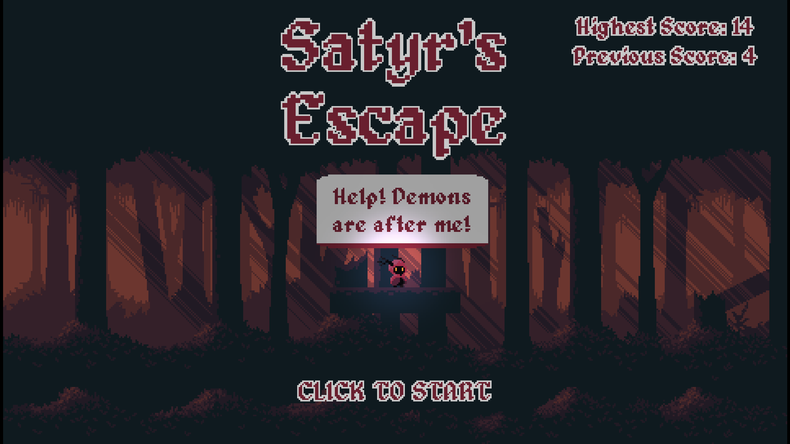

# Satyr's Escape

Help Satyr escape the relentless demons as he races through the dark woods!

[Read more about it in my website](https://www.jdiogo.dev/projects/satyrs-escape)

## Features

- Fast-paced, endless runner gameplay
- Retro pixel art graphics
- Engaging sound design and music

## Live Demo

You can play Satyr's Escape on my [itch.io page](https://kelem.itch.io)

## Controls

- Left Mouse Button -> JUMP
- Spacebar or Right Mouse Button -> Fire
- M -> MUTE ALL SOUND

## Installation

1.  Download the latest release from [my itch.io page](https://kelem.itch.io/satyrs-escape/download/eyJleHBpcmVzIjoxNzQ3OTU1NzE1LCJpZCI6MjkyMjM3OH0%3d.b7uRPzgYVuVbBkzJIDVJswdl70Q%3d).
2.  Extract the downloaded archive.
3.  Run the executable file (`Satyrs_Escape.exe` for Windows, `Satyrs_Escape.x86_64` for Linux, or `Satyrs_Escape.dmg` for macOS).

_Alternatively, if you have the Godot Engine installed:_

1.  Clone this repository: `git clone https://github.com/Diogo-k/Satyrs-Escape`
2.  Open the Godot Engine.
3.  Click "Import" and select the `project.godot` file from the cloned repository.
4.  Run the project from the Godot editor.

## Contributing

We welcome contributions to Satyr's Escape! To contribute:

1.  **Report Bugs:** If you find a bug, please open an issue on GitHub and provide detailed steps to reproduce it.
2.  **Suggest Features:** Have an idea for a new feature? Open an issue to discuss it.
3.  **Submit Pull Requests:**
    - Fork the repository.
    - Create a new branch for your feature or bugfix: `git checkout -b feature/your-feature-name` or `git checkout -b bugfix/your-bug-fix`.
    - Make your changes and commit them with clear, descriptive messages.
    - Push your changes to your fork: `git push origin feature/your-feature-name`.
    - Open a pull request to the `main` branch of this repository.

## License

This project is licensed under the MIT License. See the [LICENSE](./LICENSE) file for details.

## Contact

For support or inquiries, please open an issue on GitHub or contact [jdiogok@gmail.com](mailto:jdiogok@gmail.com).

## Versioning

Current Version: v1.0.0
